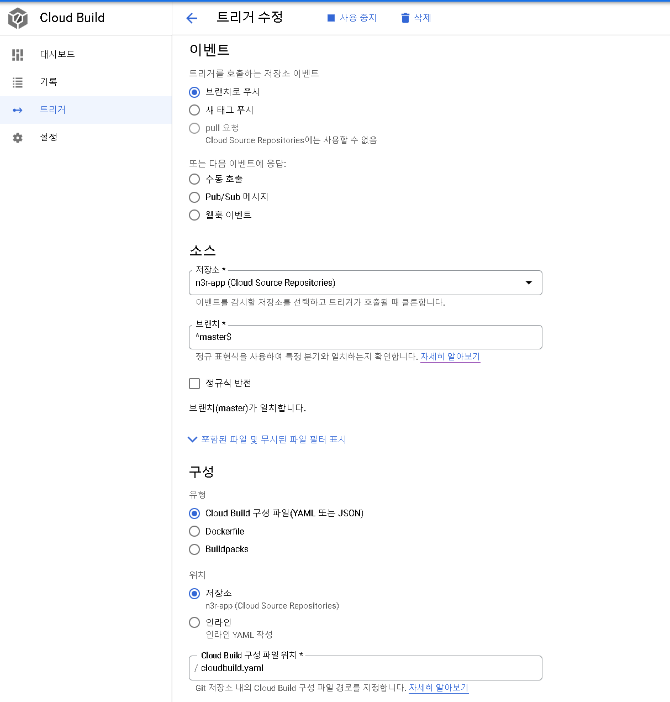

- [Azure](#azure)
  - [Azure DevOps - [서비스](https://dev.azure.com/)](#azure-devops---서비스)
  - [Azure Portal - [서비스](https://portal.azure.com/#home)](#azure-portal---서비스)
- [Google Cloud Platform](#google-cloud-platform)
  - [Cloud Build - [서비스](https://console.cloud.google.com/cloud-build/builds)](#cloud-build---서비스)


## Azure

### [Azure DevOps](https://docs.microsoft.com/ko-kr/azure/devops/?view=azure-devops) - [서비스](https://dev.azure.com/)
* [Repos](https://docs.microsoft.com/ko-kr/azure/devops/repos/get-started/what-is-repos?view=azure-devops) : 소스 리포지터리
* [Pipelines](https://docs.microsoft.com/ko-kr/azure/devops/pipelines/get-started/what-is-azure-pipelines?view=azure-devops) : 빌드/테스트
  * Pipelines
    <details>
    <summary>
    Docker 빌드후에 아래 Azure Container Registry로 push하는 파이프라인
    </summary>

    ```yaml
    # Docker
    # Build and push an image to Azure Container Registry
    # https://docs.microsoft.com/azure/devops/pipelines/languages/docker

    trigger:
    - master

    resources:
    - repo: self

    variables:
    # Container registry service connection established during pipeline creation
    dockerRegistryServiceConnection: '3b80fb98-6532-4352-af0a-b867db9f3597'
    imageRepository: 'istio-testwebapp'
    containerRegistry: 'dormael.azurecr.io'
    dockerfilePath: '$(Build.SourcesDirectory)/build/Dockerfile.cloud'
    tag: '$(Build.BuildId)'

    # Agent VM image name
    vmImageName: 'ubuntu-latest'

    stages:
    - stage: Build
    displayName: Build and push stage
    jobs:
    - job: Build
        displayName: Build
        pool:
        vmImage: $(vmImageName)
        steps:
        - task: Docker@2
        displayName: Build and push an image to container registry
        inputs:
            command: buildAndPush
            repository: $(imageRepository)
            dockerfile: $(dockerfilePath)
            buildContext: $(Build.SourcesDirectory)
            containerRegistry: $(dockerRegistryServiceConnection)
            tags: |
            $(tag)
    ```
    </details>  
  * [Environments](https://docs.microsoft.com/ko-kr/azure/devops/pipelines/process/environments?view=azure-devops) (배포 환경)
    * Kubernetes
    * Virtual machines
  * Releases
### [Azure Portal](https://docs.microsoft.com/en-us/azure/azure-portal/azure-portal-overview) - [서비스](https://portal.azure.com/#home)
* [Azure Container Registry](https://docs.microsoft.com/ko-kr/azure/devops/pipelines/ecosystems/containers/acr-template?view=azure-devops) - [서비스](https://portal.azure.com/#blade/HubsExtension/BrowseResource/resourceType/Microsoft.ContainerRegistry%2Fregistries)
* Azure App Service(Web Service) - [서비스](https://portal.azure.com/#blade/HubsExtension/BrowseResource/resourceType/Microsoft.Web%2Fsites)

## Google Cloud Platform

### [Cloud Build](https://cloud.google.com/build/docs/concepts) - [서비스](https://console.cloud.google.com/cloud-build/builds)
* [Cloud Source Repositories](https://cloud.google.com/source-repositories/docs) - [서비스](https://source.cloud.google.com/repos)
* [Triggers](https://cloud.google.com/build/docs/automating-builds/create-manage-triggers)
    <details>
    <summary>
    Trigger Definition (cloudbuild.yaml)
    </summary>

    ```yaml
    steps:
    - name: 'gcr.io/cloud-builders/docker'
      dir: '/workspace'
      args: ['build', '-t', 'gcr.io/$PROJECT_ID/istio-test-webapp:$SHORT_SHA', '-f', 'build/Dockerfile.cloud', '.']
    images: ['gcr.io/$PROJECT_ID/istio-test-webapp:$SHORT_SHA'] 
    ```
    
    </details>
* [Artifact Registry](https://cloud.google.com/artifact-registry/docs) - [서비스](https://console.cloud.google.com/artifacts)
* Kubernetes Engine - [서비스](https://console.cloud.google.com/kubernetes/list/overview)
  * [Workload(작업 부하???)](https://cloud.google.com/kubernetes-engine/docs/how-to/deploying-workloads-overview?) - [서비스](https://console.cloud.google.com/kubernetes/workload/overview)